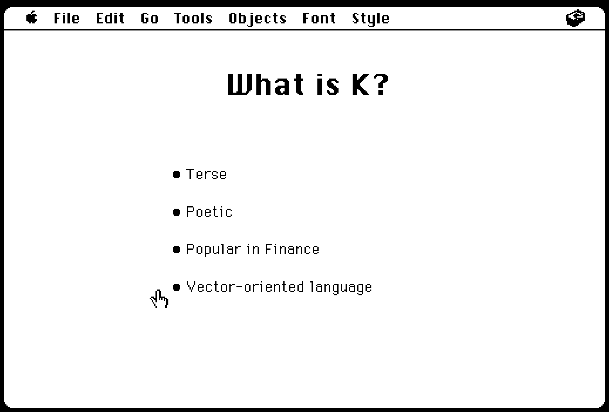
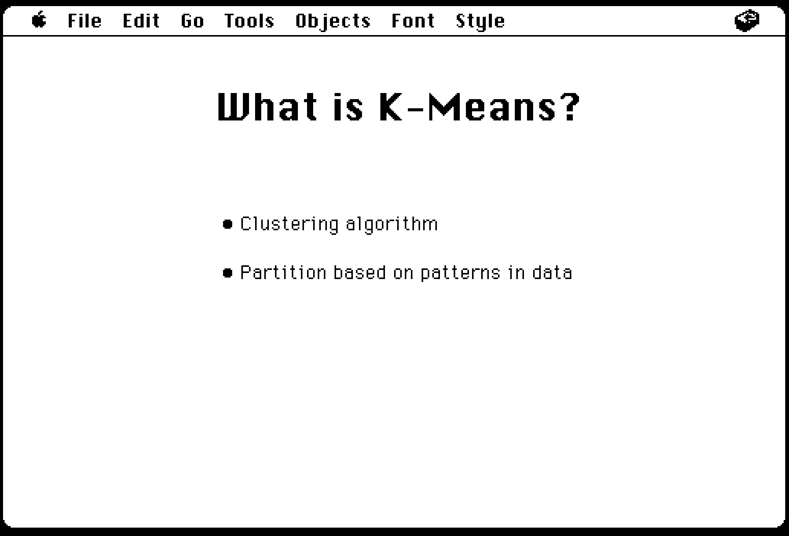
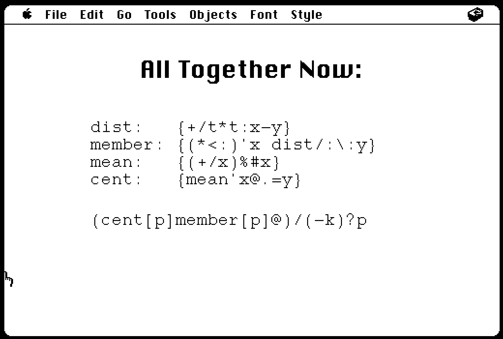

## The Meaning of K

by [Serena](https://github.com/sereprz) and [John](https://github.com/JohnEarnest/ok)

Disk image and hypercard slides for our EnthusiastiCon 2020 talk on implementing KMeans in K

> Data Science methods are not normally written in K. But what if they were?

> K is a high-performance programming language popular in finance, but rarely seen elsewhere. KMeans is a classic machine learning algorithm which partitions data into homogeneous groups.

> While K is much less well known among data scientists than Python, it shares a common heritage with NumPy as both were strongly influenced by APL.

> By showing how KMeans can be written in K, we’ll demonstrate how the features of this esoteric language encourage poetic expression of mathematical concepts and more intuitive interaction with data.

